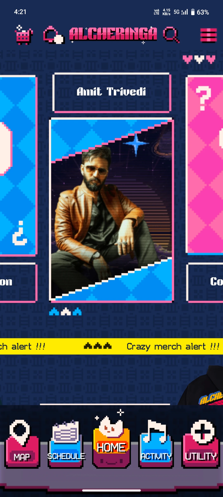
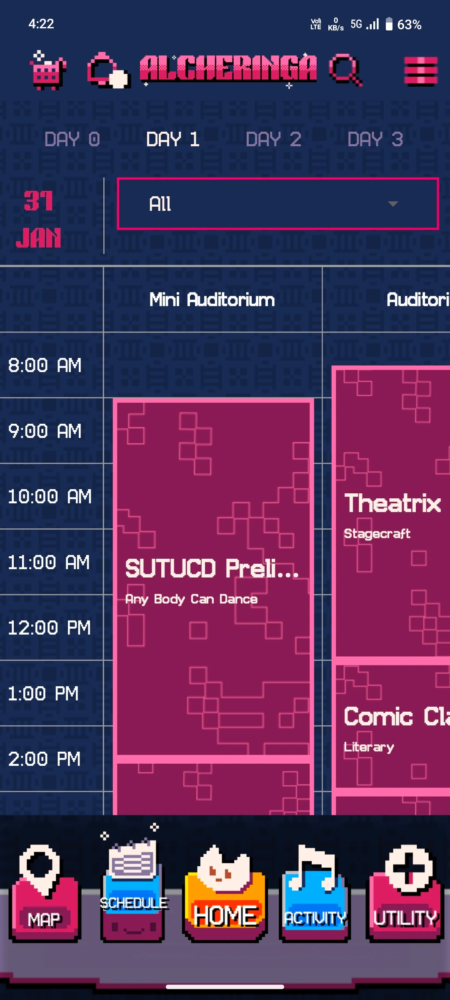
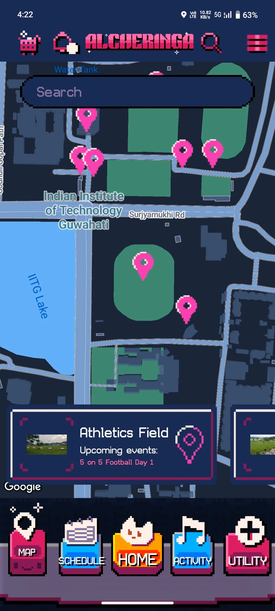
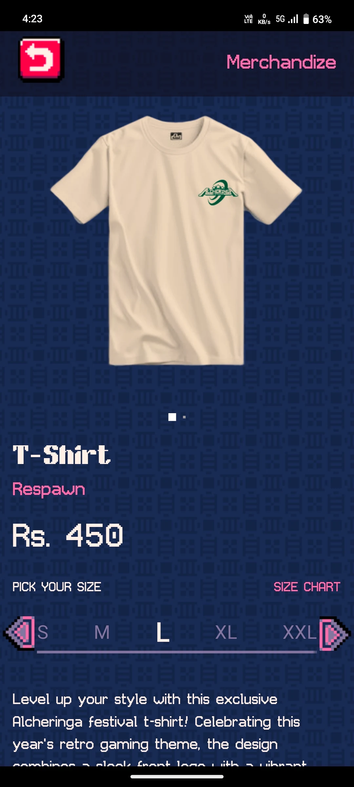
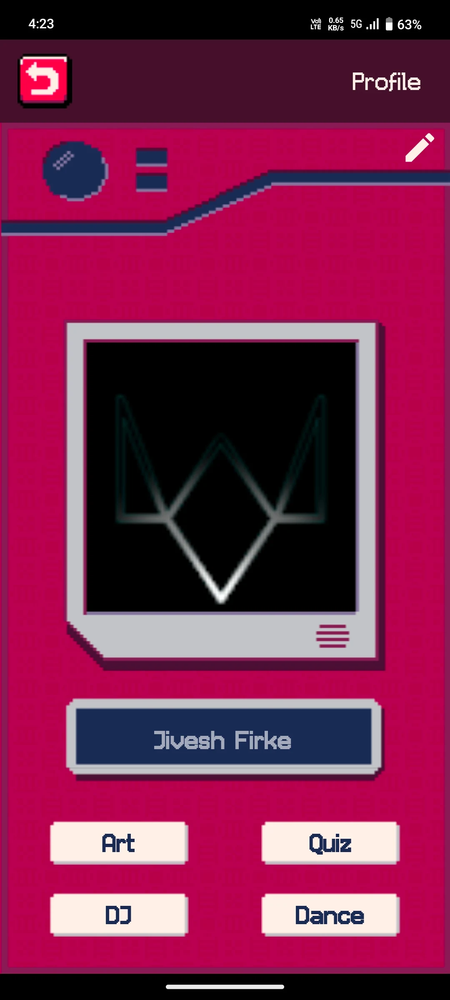

  

<h1 align="center">Alcheringa 2024 Official App</h1>

  <b>The official mobile app for Alcheringa, IIT Guwahati's annual cultural festival.</b> 
  <i>North East India's Largest College Cultural Festival</i>

    
    
    

---

## 🚀 Table of Contents

- [📖 About](#-about)
- [✨ Features](#-features)
- [🖼️ Screenshots](#-screenshots)
- [🛠️ Installation](#-installation)
- [🔥 Firebase Setup](#-firebase-setup)
- [📂 Project Structure](#-project-structure)
- [🧰 Tech Stack](#-tech-stack)

---

## 📖 About

**Alcheringa 2024** is the official mobile application for IIT Guwahati's flagship cultural festival. The app is designed to help attendees navigate the festival, discover events, manage schedules, buy merchandise, and stay updated in real time.

---

## ✨ Features

- **Event Discovery:** Browse and search all events, competitions, and pro-shows.
- **Personalized Scheduling:** Add events to your personal calendar and set reminders.
- **Interactive Campus Map:** Navigate IIT Guwahati with Google Maps integration.
- **Merchandise Store:** Explore, add to cart, and purchase official Alcheringa merchandise.
- **Authentication:** Sign in with Google, Apple, or Microsoft Outlook.
- **Real-time Notifications:** Get instant updates and announcements.
- **User Profile:** Manage your profile and view your registered events.
- **Offline Support:** Access key information even without internet.
- **Dark Mode:** Enjoy a modern, accessible UI.

---

## 🖼️ Screenshots

<!-- Add your app screenshots here -->

  
  
  
  
  
  

---

## 🛠️ Installation

### Prerequisites

- [Flutter SDK](https://flutter.dev/docs/get-started/install)
- [Dart SDK](https://dart.dev/get-dart)
- [Android Studio](https://developer.android.com/studio) or [VS Code](https://code.visualstudio.com/)
- [Firebase Project](https://console.firebase.google.com/)

### Steps

1. **Clone the Repository:**
2. **Install Dependencies:**
3. **Configure Firebase:**  
See [Firebase Setup](#firebase-setup).
4. **Run the App:**

---

## 🔥 Firebase Setup

1. Create a Firebase project at [Firebase Console](https://console.firebase.google.com/).
2. Add Android and iOS apps to your Firebase project.
3. Download `google-services.json` (Android) and `GoogleService-Info.plist` (iOS) and place them in the respective directories:
- `android/app/google-services.json`
- `ios/Runner/GoogleService-Info.plist`
4. Enable Firestore, Authentication (Google, Apple, Email/Password), and Cloud Messaging as needed.
5. Update any necessary API keys in `lib/config/` or `.env` files.

---

## 📂 Project Structure

- **models/**: Data models (Event, User, Merchandise, etc.)
- **screens/**: App screens (Home, Events, Map, Store, Profile, etc.)
- **widgets/**: Reusable UI components
- **services/**: Firebase and API integrations
- **providers/**: State management (Provider pattern)
- **utils/**: Utility functions, constants
- **config/**: App configuration, environment variables

---

## 🧰 Tech Stack

| Technology    | Use Case                        |
| ------------- | ------------------------------- |
| Flutter       | Cross-platform UI               |
| Dart          | Programming language            |
| Firebase      | Backend (Auth, Firestore, FCM)  |
| Provider      | State management                |
| Google Maps   | Campus navigation               |
| Cloud Storage | Media & assets                  |

---

  <b>Made with ❤️ for Alcheringa, IIT Guwahati</b>

